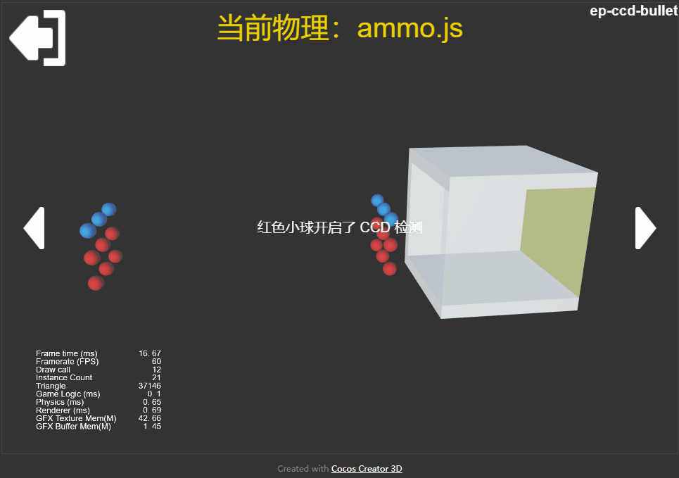
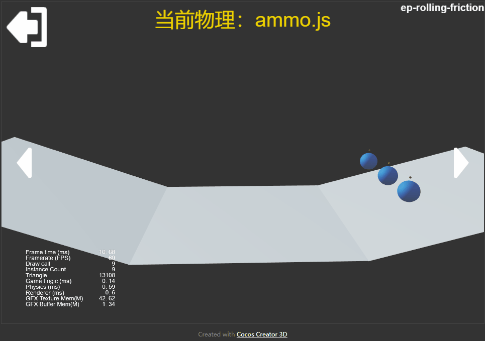
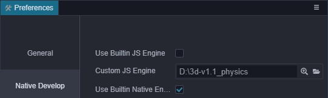
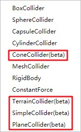

# 基于 Cocos Creator 3D v1.1 扩展的物理体验版本

目前`Cocos Creator 3D v1.1`中已经接入了`cannon.js`和`ammo.js`物理引擎，这些引擎提供了很多的功能特性，为了让大家可以体验到更多的物理功能，同时也为了满足更多的项目需求。我们在`v1.1`版本上，通过自定义引擎、组件脚本封装等方式提供了多种体验性质的功能组件。

## 功能列表

本次提供的抢先体验功能：

### 新增碰撞体

- 圆锥碰撞器 `cone collider`
- 平面碰撞器 `plane collider`
- 简单碰撞器 `simple collider`
- 地形碰撞器 `terrain collider`
- 网格碰撞器使用凸包近似的功能（由`convex`进行开关，仅`ammo`支持）

### 新增物理材质特性（仅`ammo`支持）

- 滚动摩擦系数`rolling friction`
- 自旋摩擦系数`spinning friction`

### 新增刚体\碰撞特性（仅`ammo`支持）

- 连续检测功能`ccd`
- 角色控制器脚本`character controller`

## 部分展示

- 连续检测功能
  

- 滚动摩擦系数
  

- 角色控制器和地形碰撞器
  

## 功能介绍

- 圆锥碰撞器
由半径`radius`、高度`height`、方向`direction`组成，用于圆锥体的碰撞检测和运行模拟，支持动力学刚体。

- 平面碰撞器
由法线`normal`、沿法线方向的距离`constant`组成，用于**无限**、**静态**平面的碰撞检测，只可以是静态的。此形状相对于`box`地面，性能更好。

- 简单碰撞器
由形状类型`simple shape type`和四个点`vertex0-3`组成，用于点、线、三角形、四面体的碰撞检测和运动模拟，支持动力学刚体。

- 地形碰撞器
由地形资源`terrain asset`组成，用于地形的碰撞检测，只可以是静态的。此形状比网格性能更好，并且在`cannon.js`后端中，此形状支持更加完善和稳定。

- 网格碰撞器使用凸包近似的功能
网格碰撞器上的`convex`属性，开启后，将会用近似凸包去包围网格，支持动力学刚体。

- 连续检测功能
考虑到很多用户需求子弹的物理特性，希望刚体速度过快时不会发生穿越现象。通过此功能相应的测试例，可以找到开启子弹特性的相应的办法，但遗憾的是仅有`bullet`物理支持。

- 角色控制器
此功能通过用户脚本封装，演示了一个完整的接入`ammo.js`底层物理功能的示例，通过此脚本组件，您可以轻松的实现第一、三人称的角色控制逻辑，并且可以从中学习如何结合现有框架进行组件化封装。

## 如何获取

为了使用这些抢先体验功能，您需要通过自定义引擎的方式，将引擎代码切换到相应的记录中。

### 预先需要

- [git](https://git-scm.com/)
- [node.js](https://nodejs.org/en/)

### 具体步骤

首先需要将引擎克隆下来，如以下步骤，熟悉`git`工作流的朋友也可以通过拉取这个[远端](https://github.com/JayceLai/engine/tree/3d-v1.1_physics-expriment)。

1. 点击下载引擎包[bundle](3d-v1.1_physics.zip)，完成后解压
2. 打开`git bash`或者`命令行`
3. 执行命令`git clone 3d-v1.1_physics.bundle 3d-v1.1_physics`

然后还需要一些初始化和配置的工作。

1. 在引擎目录打开`命令行`，执行`npm install & npm run build`
2. 在`v1.1`的编辑器的偏好设置的`native develop`选项中，取消使用内置`js`引擎，将自定义`js`引擎设置为克隆的仓库路径，如下图

接着重新打开编辑器，并且编译引擎。

1. 重新打开编辑器 (此时会自动编译引擎，可能需要稍等一会)
2. 为确保引擎成功编译，可以再执行一次`编译引擎`，位于在`开发者选项`中，快捷键是`ctrl`+`F7`

最后验证是否成功切换引擎。

- 在正确完成以上步骤之后，应该可以在添加组件的`Physics`项目中，看到更多的功能组件。

### 相关测试案例

点击下载对应的[展示和测试工程](3d-v1.1_demo.zip)，考虑到文件大小这里上传的是压缩包。相应工程的[远端地址](https://github.com/JayceLai/example-3d/tree/v1.1_physics-expriment/physics-3d)。

**最后，希望这些可以帮助到大家，并且真诚的恳求大家的建议，帮助我们一起构造更好的引擎**。
